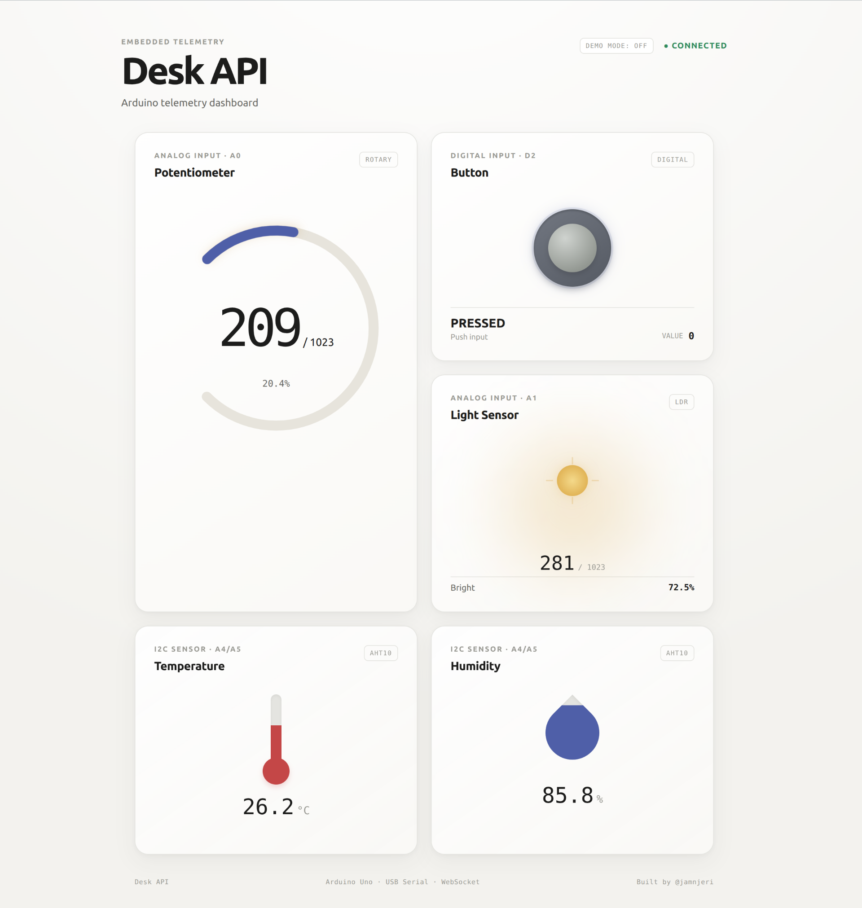
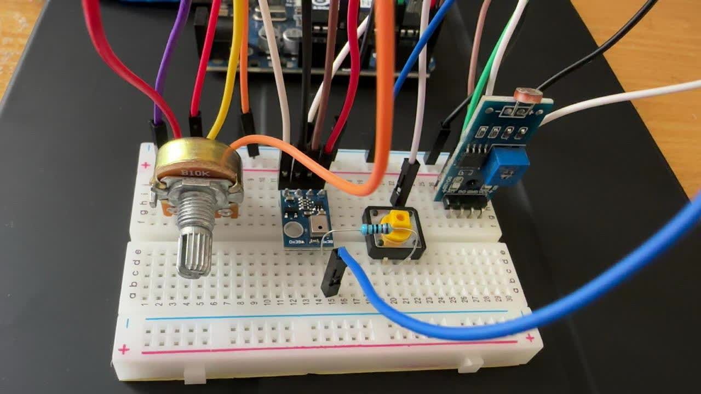

# Desk API — Arduino Telemetry Dashboard

A hardware-to-web telemetry system built to stream real-time sensor data from an Arduino to a browser dashboard.

**[View the Live Demo Dashboard](https://jamnjeri.github.io/Arduino_Project_Zero_Desk_Api/)** *(Note: Features a mock data mode for exploring without hardware)*

---

## 📸 Project Visuals

**Real-Time Hardware to Web Sync**


<!-- **The Dashboard Interface & Hardware Setup**
| Active Telemetry Dashboard | Breadboard Circuit |
| :---: | :---: |
|  |  | -->

*(Note: The dashboard also features a complete "Mock Data" mode, allowing you to test the UI without an active serial connection).*

## 🏗️ How It Works

`Physical Sensors` → `Arduino Uno` → `USB Serial (JSON)` → `Python/FastAPI` → `WebSockets` → `Web Dashboard`

The Arduino reads analog and digital inputs, publishing them as a JSON string over a 9600 baud serial connection. A Python backend intercepts this stream using PySerial and broadcasts it to connected web clients via WebSockets. Finally, the vanilla JS frontend consumes this data to animate SVG gauges and UI elements in real time.

## 🛠️ Tech Stack & Hardware

* **Hardware:** Arduino Uno, Potentiometer (A0), LDR (A1), Push Button (D2), AHT10 Temp/Humidity Sensor (I²C)
* **Firmware:** C++, PlatformIO, Adafruit AHTX0 library
* **Backend:** Python, FastAPI, PySerial, Uvicorn, WebSockets
* **Frontend:** HTML, CSS, Vanilla JS, Custom SVG animations

---

## ⚙️ Quick Start

### 1. Flash Firmware
Open the project in VS Code with PlatformIO installed and upload to the Arduino:
```bash
pio run --target upload
```

### 2. Run Backend
Navigate to the backend directory, install dependencies, and start the FastAPI server:
```bash
cd desk-api/backend
pip install -r requirements.txt
uvicorn main:app --reload
```
*(Note: Ensure `SERIAL_PORT` in `main.py` matches your Arduino's assigned port)*

### 3. Run Frontend
Serve the frontend on a separate port (e.g., 3000) to avoid conflicting with the backend:
```bash
cd desk-api/frontend
python -m http.server 3000
```
Open `http://localhost:3000` in your browser to view the live dashboard.

---

## 📖 The Full Story

Curious about why I built this, the hardware bugs I squashed, and the lessons learned along the way? 

<!-- Read the full breakdown on my blog: **[Building My First Hardware-to-Web Pipeline — The Desk API](#)** -->
